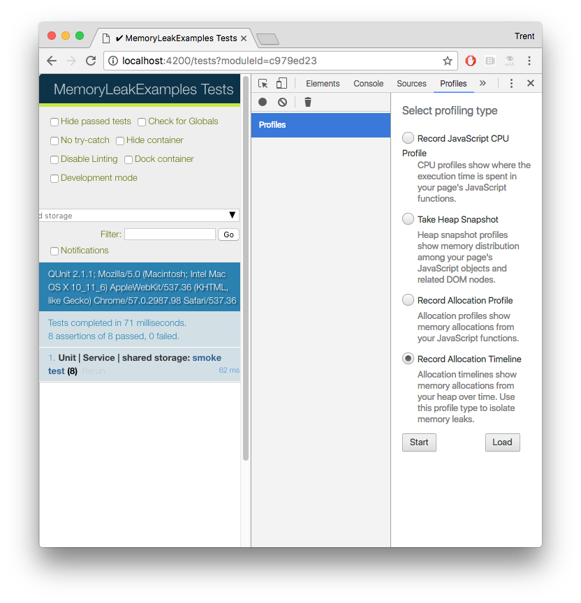
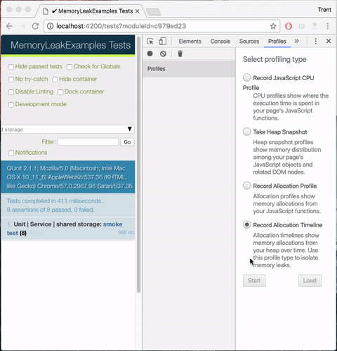
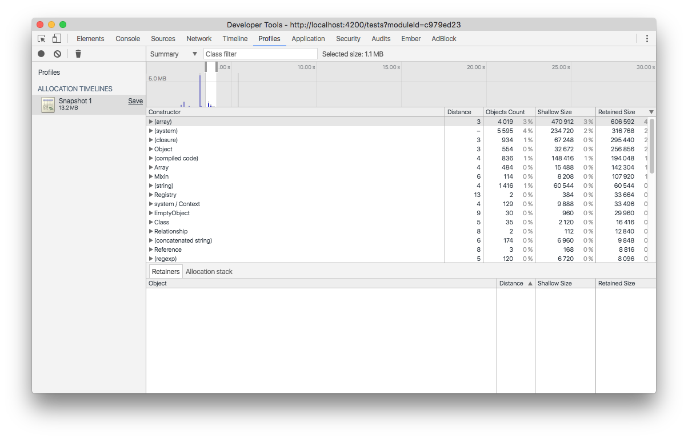
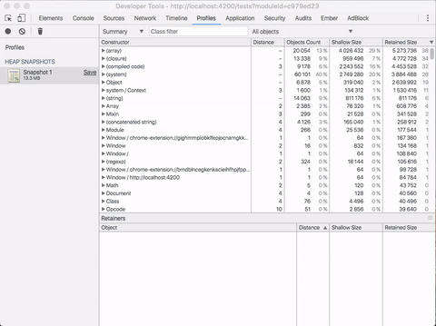
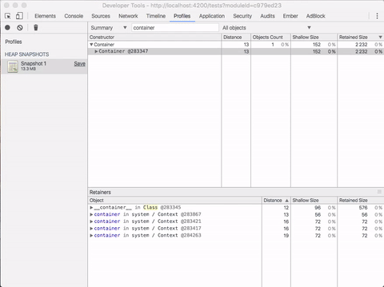

# Exercise #1 - Prototype Reference Leaks

This first exercise will look at "prototype reference" leaks. These are memory
leaks that occur because state is stored via a reference on a class' prototype.

Let's dive in and see how to find and fix them!

## Identifying Memory Leaks

We're going to get right into "doing" and save the more conceptual discussion of
"how to identify memory leaks" for later.

Let's visit our [test page](http://localhost:4200/tests/) as covered in the
introduction and select the "_Unit | Service | shared storage_" module from the
dropdown.


This module only has one [smoke test](https://en.wikipedia.org/wiki/Smoke_testing_(software))
currently, but it is passing so we can be assured the basic functionality is
working as expected. However, we have a hunch that it may be causing a memory
leak, but we want to dive in and verify our assumptions before trying to change
any code.

> You should **always verify** behavior before changing it. If you suspect a
> memory leak, verify it before changing existing code, especially if the
> changes will increase complexity.

The first thing we want to do is open up our memory profiler. We do this by
opening the Chrome Developer Tools (`Ctrl + Shift + I` on Windows,
`Cmd + Opt + I` on Mac) and selecting the "Profiles" tab.



This tab has some powerful features in it and you should try to familiarize
yourself with all of them at some point, but today we are really only concerned
with two of the options: "Record Allocation Timeline" and "Take Heap Snapshot".

### Record Allocation Timeline

Since we suspect a leak in our code, we want to take a look at our application's
memory allocation over time. In a healthy app with no memory leaks, we would
expect little, if any, memory to be retained after a test in our suite finishes.
So, we can use the "Record Allocation Timeline" feature to look at how we are
using memory over the course of our test run.

It's pretty simple. From the test page, click "Start" to begin recording,
reload the page, and then hit the red recording button to stop when the tasks
you are concerned with finish; in our case that would be after the test finishes.



Now that we have a recording, we can take a look at it.

You'll notice that the timeline is primarily a series of columns with some blue
and gray portions to them. Each column represents memory allocated during that
moment in time; the gray part is memory that was then subsequently released and
the blue is memory that is still being retained.


For applications with memory leaks, you will see many blue columns when
recording over long periods of time. The cumulative effect of all this retained
memory would be a leak that impacts the performance of your application.

A quick word of warning here, _not all retained memory is due to leaks_.
Sometimes retained memory is simply made up of new function definitions,
strings, or maybe the evaluation of a JS module, while these add up over time,
they should be a one time cost and not considered leaks.

We can look at either the whole recorded timeline, or a portion, by dragging the
window in the summary view.



Looking at the timeline recording, it seems like we may have a leak because
there is some blue that is not getting cleaned up around the time the test
executes. However, we're still a little unsure, so let's use another tool to
help us verify.

### Take Heap Snapshot

For Ember applications we are primarily worried with leaking one specific
construct: the `container`. This is because the `container` holds all the state
for our application (or test) and thus, if it is not cleaned up, we're going
to use up memory very quickly.

Thankfully, since we know what might be leaking, we can check for it easily. We
can take a "heap snapshot" at any point in time to see what memory is
currently being used. Simply choose "Take Heap Snapshot" as the profiling type
and then click the "record" button.


If we do this after running our test, then we will be able to see all the
objects currently held in memory, including those introduced (or "leaked") by
our test. However, this is a lot of information, and most of it isn't
particularly interesting.

Since we know what we're looking for, we can quickly filter through the retained
objects by using the "class filter" at the top of the summary view. In this
case, we're looking for objects of the `Container` class.



We can see that we have one retained. This is bad, because it should have been
cleaned up before. This could lead to a potentially large memory leak when
running more than just one test.

So, how do we fix it? Well, we need to figure out why this is being "retained"
in memory.

If we click on the object in the snapshot, we'll get a list of "retainers" at
the bottom of the profiling tab. This will show you the references to the
selected object that are keeping it in memory. The "distance" will let you know
how many references it takes to get to the global context.

From here, the process is a bit fuzzy. Essentially, we follow the "shortest"
path to the global and look for objects that are part of our application's code.
In this case, as we walk up the retainer tree, we find the `_data` property
which is part of our service's class.



We should expect the `_data` property to get cleaned up when the service is
destroyed (e.g., at the end of the test). So, it is likely that this is the
source of our memory leak.

If we take a look at the source code:

```js
// app/services/shared-storage.js
export default Ember.Service.extend({
  _data: Object.create(null)
});
```

We'll notice that the `_data` property is set to an object during `extend`. This
means that it is being placed on the `prototype` of the class. Since `protoypes`
are never destroyed, any changes to the `_data` property will stick around
indefinitely.

> It is worth noting that this is primarily a problem since Object's are
> non-primitive values, meaning that as we modify them, the value isn't replaced.
> For primitive values, if we modify them on an instance of a class, it will no
> longer be modiyfing the `prototype`, but will instead modify the instance
> directly.

So, how do we fix this? Thankfully, it is easy, all we need to do is set `_data`
on each _instance_ of the class, rather than on the class itself. We can do this
during `init`, which can be thought of as the constructor function:

```js
export default Ember.Service.extend({
  init() {
    this._super(...arguments);
    this._data = Object.create(null);
  }
});
```

And that's it! You should now be able to re-run the test, take a heap snapshot,
and verify that the memory leak is no longer present.

## Key Takeaways

* Use "Record Allocation Timeline" to identify the presence of memory leaks.
* Use "Take Heap Snapshot" to verify leaked objects and figure out why they're
leaking.
* Do _NOT_ set non-primitive values on a class' `prototype`. Instead, initialize
them during the class' instantiation.

[Prev: Exercise #0](./exercise-0.md) | [Next: Exercise #2](./exercise-2.md)
