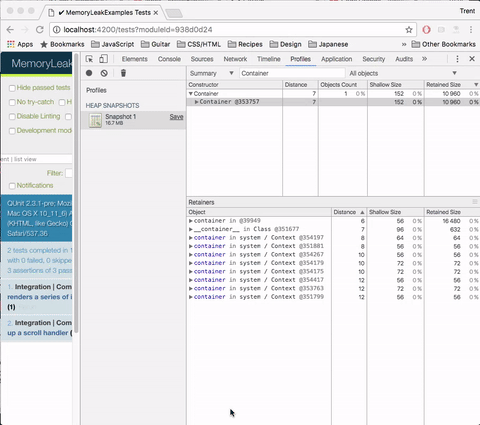

# Exercise #3 - Scope Leaks

This exercise will pick up right where [Exercise #2](./exercise-2.md) left off
and will look at "scope" leaks. These are memory leaks that occur due to state
being accessible via the scope of some retained object in memory.

## Identifying The Leak

Exercise #2 left off with the "_Integration | Component | list view_" test still
having a memory leak after fixing one. At this point, you should be relatively
comfortable with using the memory profiler to identify where a memory leak is
coming from, so we will gloss over some steps.

## Fixing The Leak



Here, we have another `context in ()` in our retainer graph, but this time it
does not look like we're actually referencing any variables in the function
which seems to be leaking:

```js
init() {
  let component = this;
  component._super(...arguments);

  if (config.environment !== 'production') {
    let id = component.toString();
    window.lastComponentRendered = function() { return id; };
  }
}
```

In theory, it seems like the `lastComponentRendered` function above should not
be causing the `component` to leak. However, since `component` is still within
the accessible scope of the function, it is retained in memory. Thus, we call
this a scope leak because we are leaking state indirectly via the scope a
function has access to.

So, how do we fix this? Well, simply remove the variable from scope _or_ move
the function to a different scope. Here we do both:

```js
Ember.Component.reopen({
  init() {
    this._super(...arguments);
    this._setupLastComponentRendered();
  },

  _setupLastComponentRendered() {
    if (config.environment !== 'production') {
      let id = this.toString();
      window.lastComponentRendered = function() { return id; };
    }
  }
});
```

But, if we check the profiler again, this doesn't seem to fix our leak. Why?

Well the reason is that Babel transpiles `let` statements that are within a
different block into something like this:

```js
_setupLastComponentRender() {
  var _this = this; // GRR! This is annoying...

  if (config.environment !== 'production') {
    (function () { // So is this!
      var id = _this.toString();
      window.lastComponentRendered = function () {
        return id;
      };
    })();
  }
}
```

And the introduced `_this` variable is now leaking into our scope again.

We can fix this by making the scope of the `let` and the function the same, like
so:

```js
Ember.Component.reopen({
  init() {
    this._super(...arguments);

    if (config.environment !== 'production') {
      this._setupLastComponentRendered();
    }
  },

  _setupLastComponentRendered() {
    let id = this.toString();
    window.lastComponentRendered = function() { return id; };
  }
});
```

This has the added benefit of making it easier to tell which steps during `init`
are actually executed in a given environment as well. Overall, this pattern is
likely a better approach, and it actually fixes our issue!

So, with that you should have successfully fixed all the leaks in this test.

## Key Takeaways

* Don't assume a fix actually fixed a leak until verification occurs.
* Be wary of transpilation side-effects. While Babel and others do well in most
  circumstances, they can indirectly cause issues.
* Scope leaks occurs just by having access to variables in scope, even if
  they're not used.
* To fix scope leaks, extract closure creation into functions with just the
  right amount of state in scope.

[Prev: Exercise #2](./exercise-2.md)
